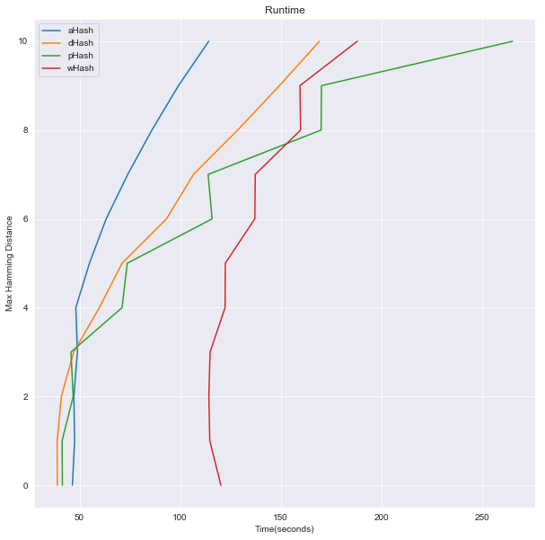

# Duplicate Image Detector
This program searches a directory for potentially duplicate images using perceptual hashing algorithms. 

## Runtime
In experiments, the program is able to find all 1,002 duplicate images (out of a dataset of 11,002 total images) in about 40 seconds. This efficiency is achieved through the use of BK-Trees, which allows fast hash comparison. For more information, see [here](Duplicate%20Image%20Benchmark.pdf).

## Requirements:

* Python 3.0+
* [Pillow](https://python-pillow.org/) </li>
* [ImageHash](https://github.com/JohannesBuchner/imagehash) </li>
* [pybktree](https://github.com/Jetsetter/pybktree) </li>

## Instructions:
Place the script in the folder containing the images.
